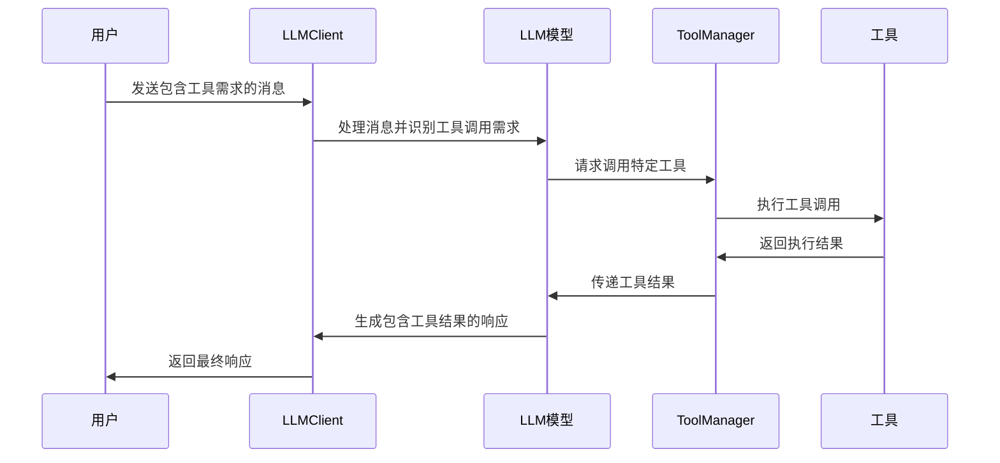

# LLMClient 工具使用指南

## 概述

LLMClient 是一个强大的 LangChain 模型适配器，支持工具调用和结果解析。本指南将详细说明如何使用工具系统，包括工具的工作原理、如何绑定使用工具，以及如何为模型添加新工具。

## 目录

1. [工具系统架构](#工具系统架构)
2. [工具工作原理](#工具工作原理)  
3. [如何绑定和使用工具](#如何绑定和使用工具)
4. [如何添加新工具](#如何添加新工具)
5. [实战示例：Web搜索工具](#实战示例web搜索工具)
6. [最佳实践](#最佳实践)
7. [常见问题](#常见问题)

## 工具系统架构

LLMClient 的工具系统采用分层架构设计：

```
┌─────────────────┐
│   LLMClient     │  ← 主要接口层
├─────────────────┤
│  ToolManager    │  ← 工具调用管理层
├─────────────────┤
│   LangChain     │  ← 底层工具绑定层
│   BaseTool      │
└─────────────────┘
```

### 核心组件

1. **LLMClient**: 主要客户端类，提供工具管理接口
2. **ToolManager**: 工具调用生命周期管理器
3. **BaseTool**: LangChain 的工具基类
4. **RequestManager**: 请求管理和并发控制

## 工具工作原理

### 工具绑定机制

1. **工具注册**: 通过 `add_tools()` 方法将工具添加到 LLMClient
2. **模型绑定**: 使用 LangChain 的 `bind_tools()` 方法将工具绑定到模型
3. **自动调用**: 模型在对话中自动识别何时需要调用工具
4. **结果处理**: 工具执行结果自动整合到对话流程中

### 工具调用流程



### 并发控制

工具调用支持并发控制，通过以下机制实现：

- **最大并发数**: 可配置同时执行的工具调用数量
- **调用队列**: 超出并发限制的调用进入队列等待
- **状态跟踪**: 实时跟踪每个工具调用的状态

## 如何绑定和使用工具

### 基本用法

```python
from modules.llm import LLMClient
from langchain.tools import BaseTool

# 1. 初始化客户端
client = LLMClient(
    system_prompt="你是一个有用的AI助手，可以使用工具来帮助用户。",
    max_concurrent_calls=3  # 最大并发工具调用数
)

# 2. 添加工具
tools = [your_tool1, your_tool2]
client.add_tools(tools)

# 3. 使用工具进行对话
response = await client.chat("请帮我搜索最新的AI新闻")
```

### 工具管理方法

```python
# 获取当前工具列表
current_tools = client.get_tools()

# 按名称获取特定工具
specific_tool = client.get_tool_by_name("web_search")

# 移除特定工具
success = client.remove_tool("web_search")

# 清空所有工具
client.clear_tools()
```

## 如何添加新工具

### 步骤1：定义工具类

创建继承自 LangChain `BaseTool` 的工具类：

```python
from langchain.tools import BaseTool
from pydantic import BaseModel, Field
from typing import Type, Optional

class WebSearchInput(BaseModel):
    """Web搜索工具输入参数"""
    query: str = Field(description="搜索查询词")
    max_results: int = Field(default=5, description="最大结果数量")

class WebSearchTool(BaseTool):
    """Web搜索工具"""
    name = "web_search"
    description = "搜索互联网上的最新信息"
    args_schema: Type[BaseModel] = WebSearchInput
    
    def _run(self, query: str, max_results: int = 5) -> str:
        """同步执行方法"""
        # 实现具体的搜索逻辑
        return self._perform_search(query, max_results)
    
    async def _arun(self, query: str, max_results: int = 5) -> str:
        """异步执行方法"""
        # 实现异步搜索逻辑
        return await self._perform_search_async(query, max_results)
    
    def _perform_search(self, query: str, max_results: int) -> str:
        """执行搜索的具体实现"""
        # 这里实现实际的搜索逻辑
        pass
    
    async def _perform_search_async(self, query: str, max_results: int) -> str:
        """异步执行搜索的具体实现"""
        # 这里实现异步搜索逻辑
        pass
```

### 步骤2：实现工具逻辑

```python
import aiohttp
import json
from typing import List, Dict

class WebSearchTool(BaseTool):
    # ... 前面的定义 ...
    
    def __init__(self, api_key: str = None):
        super().__init__()
        self.api_key = api_key
        self.search_url = "https://api.search.com/v1/search"  # 示例API
    
    async def _perform_search_async(self, query: str, max_results: int) -> str:
        """异步执行搜索"""
        headers = {
            "Authorization": f"Bearer {self.api_key}",
            "Content-Type": "application/json"
        }
        
        params = {
            "q": query,
            "count": max_results,
            "format": "json"
        }
        
        try:
            async with aiohttp.ClientSession() as session:
                async with session.get(
                    self.search_url, 
                    headers=headers, 
                    params=params
                ) as response:
                    if response.status == 200:
                        data = await response.json()
                        return self._format_search_results(data)
                    else:
                        return f"搜索失败: HTTP {response.status}"
        except Exception as e:
            return f"搜索出错: {str(e)}"
    
    def _format_search_results(self, data: Dict) -> str:
        """格式化搜索结果"""
        results = []
        for item in data.get("results", []):
            title = item.get("title", "")
            url = item.get("url", "")
            snippet = item.get("snippet", "")
            results.append(f"标题: {title}\n链接: {url}\n摘要: {snippet}\n")
        
        return "\n".join(results) if results else "未找到相关结果"
```

### 步骤3：注册和使用工具

```python
# 创建工具实例
web_search_tool = WebSearchTool(api_key="your_api_key_here")

# 添加到客户端
client.add_tools([web_search_tool])

# 测试工具调用
response = await client.chat("请搜索关于Python异步编程的最新文章")
print(response.content)
```

## 实战示例：Web搜索工具

这里提供一个完整的Web搜索工具实现示例：

### 完整代码实现

```python
# tools/web_search.py
import aiohttp
import asyncio
from langchain.tools import BaseTool
from pydantic import BaseModel, Field
from typing import Type, List, Dict, Optional
import logging

# 配置日志
logger = logging.getLogger(__name__)

class WebSearchInput(BaseModel):
    """Web搜索工具输入参数"""
    query: str = Field(description="要搜索的关键词或问题")
    max_results: int = Field(default=5, description="返回的最大结果数量，范围1-10")
    language: str = Field(default="zh", description="搜索语言，zh表示中文，en表示英文")

class SearchResult(BaseModel):
    """单个搜索结果"""
    title: str
    url: str
    snippet: str
    published_date: Optional[str] = None

class WebSearchTool(BaseTool):
    """
    Web搜索工具
    
    功能：
    - 支持中英文搜索
    - 可配置返回结果数量
    - 异步处理提高性能
    - 结果格式化输出
    """
    
    name = "web_search"
    description = """
    用于搜索互联网上的最新信息。当用户询问需要实时信息、新闻、当前事件、
    最新数据或我不知道的信息时，可以使用此工具进行搜索。
    
    适用场景：
    - 查找最新新闻和时事
    - 获取实时股价、天气等信息
    - 搜索技术文档和教程
    - 查找产品信息和评价
    """
    args_schema: Type[BaseModel] = WebSearchInput
    return_direct = False
    
    def __init__(self, api_key: str, search_engine: str = "bing"):
        """
        初始化Web搜索工具
        
        Args:
            api_key: 搜索API的密钥
            search_engine: 搜索引擎类型 ("bing", "google", "duckduckgo")
        """
        super().__init__()
        self.api_key = api_key
        self.search_engine = search_engine
        self.timeout = 10  # 请求超时时间
        
        # 配置不同搜索引擎的API
        self.api_configs = {
            "bing": {
                "url": "https://api.bing.microsoft.com/v7.0/search",
                "headers": {"Ocp-Apim-Subscription-Key": api_key}
            },
            "google": {
                "url": "https://www.googleapis.com/customsearch/v1",
                "headers": {}
            }
        }
    
    def _run(self, query: str, max_results: int = 5, language: str = "zh") -> str:
        """同步执行方法 - 调用异步方法"""
        return asyncio.run(self._arun(query, max_results, language))
    
    async def _arun(self, query: str, max_results: int = 5, language: str = "zh") -> str:
        """异步执行搜索"""
        logger.info(f"开始搜索: {query} (最大结果数: {max_results}, 语言: {language})")
        
        try:
            # 验证参数
            max_results = max(1, min(max_results, 10))
            
            # 执行搜索
            if self.search_engine == "bing":
                results = await self._search_bing(query, max_results, language)
            elif self.search_engine == "google":
                results = await self._search_google(query, max_results, language)
            else:
                return f"不支持的搜索引擎: {self.search_engine}"
            
            # 格式化结果
            if results:
                formatted_results = self._format_results(results, query)
                logger.info(f"搜索完成，返回 {len(results)} 个结果")
                return formatted_results
            else:
                return f"没有找到关于 '{query}' 的相关结果。"
                
        except Exception as e:
            error_msg = f"搜索出错: {str(e)}"
            logger.error(error_msg)
            return error_msg
    
    async def _search_bing(self, query: str, max_results: int, language: str) -> List[SearchResult]:
        """使用Bing搜索API"""
        config = self.api_configs["bing"]
        
        params = {
            "q": query,
            "count": max_results,
            "offset": 0,
            "mkt": "zh-CN" if language == "zh" else "en-US",
            "freshness": "Month"  # 获取最近一个月的结果
        }
        
        async with aiohttp.ClientSession(timeout=aiohttp.ClientTimeout(total=self.timeout)) as session:
            async with session.get(
                config["url"],
                headers=config["headers"],
                params=params
            ) as response:
                if response.status == 200:
                    data = await response.json()
                    return self._parse_bing_results(data)
                else:
                    raise Exception(f"Bing API错误: HTTP {response.status}")
    
    async def _search_google(self, query: str, max_results: int, language: str) -> List[SearchResult]:
        """使用Google自定义搜索API"""
        config = self.api_configs["google"]
        
        params = {
            "key": self.api_key,
            "cx": "your_custom_search_engine_id",  # 需要配置
            "q": query,
            "num": max_results,
            "lr": f"lang_{language}"
        }
        
        async with aiohttp.ClientSession(timeout=aiohttp.ClientTimeout(total=self.timeout)) as session:
            async with session.get(
                config["url"],
                params=params
            ) as response:
                if response.status == 200:
                    data = await response.json()
                    return self._parse_google_results(data)
                else:
                    raise Exception(f"Google API错误: HTTP {response.status}")
    
    def _parse_bing_results(self, data: Dict) -> List[SearchResult]:
        """解析Bing搜索结果"""
        results = []
        web_pages = data.get("webPages", {}).get("value", [])
        
        for item in web_pages:
            result = SearchResult(
                title=item.get("name", ""),
                url=item.get("url", ""),
                snippet=item.get("snippet", ""),
                published_date=item.get("dateLastCrawled")
            )
            results.append(result)
        
        return results
    
    def _parse_google_results(self, data: Dict) -> List[SearchResult]:
        """解析Google搜索结果"""
        results = []
        items = data.get("items", [])
        
        for item in items:
            result = SearchResult(
                title=item.get("title", ""),
                url=item.get("link", ""),
                snippet=item.get("snippet", "")
            )
            results.append(result)
        
        return results
    
    def _format_results(self, results: List[SearchResult], query: str) -> str:
        """格式化搜索结果为可读文本"""
        if not results:
            return f"没有找到关于 '{query}' 的搜索结果。"
        
        formatted = f"🔍 关于 '{query}' 的搜索结果：\n\n"
        
        for i, result in enumerate(results, 1):
            formatted += f"**{i}. {result.title}**\n"
            formatted += f"   🔗 {result.url}\n"
            formatted += f"   📄 {result.snippet}\n"
            if result.published_date:
                formatted += f"   📅 {result.published_date}\n"
            formatted += "\n"
        
        # 添加搜索提示
        formatted += "💡 提示：如需更详细信息，请访问相关链接。"
        
        return formatted

# 工具工厂函数
def create_web_search_tool(api_key: str, search_engine: str = "bing") -> WebSearchTool:
    """
    创建Web搜索工具实例
    
    Args:
        api_key: 搜索API密钥
        search_engine: 搜索引擎类型
        
    Returns:
        WebSearchTool: 配置好的搜索工具实例
    """
    return WebSearchTool(api_key=api_key, search_engine=search_engine)
```

### 使用示例

```python
# example_usage.py
import asyncio
from modules.llm import LLMClient
from tools.web_search import create_web_search_tool

async def main():
    # 1. 创建工具
    web_search_tool = create_web_search_tool(
        api_key="your_bing_api_key",
        search_engine="bing"
    )
    
    # 2. 初始化LLM客户端
    client = LLMClient(
        system_prompt="""
        你是一个智能助手，可以使用网络搜索工具来获取最新信息。
        当用户询问需要实时数据或最新信息时，请使用web_search工具。
        搜索完成后，基于搜索结果为用户提供准确、有用的回答。
        """,
        max_concurrent_calls=3
    )
    
    # 3. 添加工具
    client.add_tools([web_search_tool])
    
    # 4. 测试不同类型的搜索
    test_queries = [
        "Python 3.12的新特性有哪些？",
        "2024年人工智能发展趋势",
        "今天的天气如何？",
        "比特币最新价格"
    ]
    
    for query in test_queries:
        print(f"\n🔍 查询: {query}")
        print("-" * 50)
        
        try:
            response = await client.chat(query, save_history=True)
            print(f"🤖 回答: {response.content}")
        except Exception as e:
            print(f"❌ 错误: {e}")
        
        print("=" * 50)

if __name__ == "__main__":
    asyncio.run(main())
```

### 配置文件示例

```python
# config/tools_config.py
import os
from typing import Dict, Any

class ToolsConfig:
    """工具配置类"""
    
    # Web搜索工具配置
    WEB_SEARCH_CONFIG = {
        "api_key": os.getenv("BING_SEARCH_API_KEY"),
        "search_engine": "bing",
        "timeout": 10,
        "max_results_default": 5
    }
    
    # 其他工具配置
    # WEATHER_CONFIG = {...}
    # DATABASE_CONFIG = {...}
    
    @classmethod
    def get_web_search_config(cls) -> Dict[str, Any]:
        """获取Web搜索工具配置"""
        config = cls.WEB_SEARCH_CONFIG.copy()
        
        if not config["api_key"]:
            raise ValueError("请设置环境变量 BING_SEARCH_API_KEY")
        
        return config
```

## 最佳实践

### 1. 工具设计原则

- **单一职责**: 每个工具只负责一个明确的功能
- **清晰描述**: 提供详细的工具描述和参数说明
- **错误处理**: 优雅处理各种异常情况
- **性能优化**: 使用异步方法提高性能

### 2. 参数验证

```python
def _run(self, query: str, max_results: int = 5) -> str:
    # 验证参数
    if not query or not query.strip():
        return "错误：搜索查询不能为空"
    
    if max_results < 1 or max_results > 10:
        max_results = 5  # 使用默认值
    
    # 继续执行...
```

### 3. 并发控制

```python
# 在LLMClient初始化时设置合适的并发数
client = LLMClient(
    max_concurrent_calls=3,  # 根据API限制调整
    request_config=RequestConfig(
        max_concurrent_requests=5,
        max_requests_per_minute=60
    )
)
```

### 4. 缓存策略

```python
from functools import lru_cache
import time

class WebSearchTool(BaseTool):
    def __init__(self):
        super().__init__()
        self.cache = {}
        self.cache_ttl = 300  # 5分钟缓存
    
    def _get_cached_result(self, query: str) -> str | None:
        """获取缓存结果"""
        if query in self.cache:
            result, timestamp = self.cache[query]
            if time.time() - timestamp < self.cache_ttl:
                return result
            else:
                del self.cache[query]
        return None
    
    def _cache_result(self, query: str, result: str) -> None:
        """缓存结果"""
        self.cache[query] = (result, time.time())
```

## 总结

LLMClient 的工具系统提供了强大而灵活的扩展机制，通过本指南您可以：

1. ✅ 理解工具系统的架构和工作原理
2. ✅ 掌握工具的绑定和使用方法
3. ✅ 学会创建自定义工具
4. ✅ 实现复杂的Web搜索工具
5. ✅ 应用最佳实践提高工具质量

希望这份指南能帮助您更好地使用和扩展 LLMClient 的工具功能！

---
